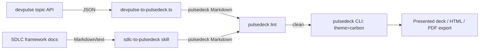

# pulsedeck

## What this is

A local-first Markdown-to-slides presentation tool, forked from
[`deckrun`](https://github.com/arpitbbhayani/deckrun) (upstream by Arpit
Bhayani) and extended for one team's actual workflow: AI/dev enablement
training sessions and internal technical presentations.

The core engine — parsing, theming, presenting, PDF export, and the
local-only server — is untouched upstream code. What this fork adds is a
small number of additive, enterprise-specific layers on top: a theme, an
exporter script, a CI lint workflow, and a Claude Code skill.

## Goals

- Replace hand-built HTML training decks with Markdown decks that are
  reviewable, diffable, and lintable like code.
- Give those decks a consistent, presentable visual identity (`ibm carbon`
  theme) instead of whatever a given session's HTML happened to look like.
- Turn `devpulse` topic clusters (papers, repos, discussions it already
  aggregates) into presentable decks without maintaining two separate
  content pipelines.
- Make deck quality a CI-enforced bar (`pulsedeck lint` in
  `.github/workflows/lint-decks.yml`), not a manual review.
- Make "doc → deck" a Claude Code skill (`sdlc-to-pulsedeck`) so it's
  repeatable, not a one-off.

## Non-goals

- **Not** merging `deckrun`/`pulsedeck`'s codebase into `devpulse`'s, or
  vice versa. `pulsedeck`'s server is loopback-only by design; `devpulse` is
  a hosted multi-user app. They stay separate projects connected by a data
  format (Markdown in, JSON out), not shared code.
- **Not** trying to replicate any internal brand guide. The `ibm carbon`
  theme uses IBM's *public* Carbon Design System tokens — accurate to what's
  publicly documented, not to any internal guide.
- **Not** building deck hosting, sharing, or multi-user editing. Decks are
  files; they live in git like everything else does.
- **Not** modifying the core rendering, parsing, or presenter engine.
  Everything here is additive — a theme entry, a standalone script, a CI
  config, a skill file. If a change requires touching `src/generate.ts`,
  `src/parser.ts`, or `src/index.ts`'s core logic, that's a signal to stop
  and reconsider scope before proceeding.

## Naming

The package is `pulsedeck` (npm-available at spec time; pairs naturally
with `devpulse` given the export pipeline between them). The CLI binary is
also `pulsedeck`. Not renamed: the CLI's internal route names (`/__present`,
etc.), the theme id `carbon`, upstream's source file names, the
`DECKRUN_BROWSER` env var, and the `deckrun.*` `localStorage` keys — all
internal implementation details, not part of the public rename surface.

## Components

| Component | Lives where |
|---|---|
| `carbon` theme (IBM Carbon Design System tokens) | `src/themes.ts` — `SPECS.carbon`, id in `THEME_IDS` |
| `devpulse` → deck exporter | `scripts/devpulse-to-pulsedeck.ts` |
| CI lint workflow | `.github/workflows/lint-decks.yml` |
| Claude Code skill: `sdlc-to-pulsedeck` | `.claude/skills/sdlc-to-pulsedeck/SKILL.md` |
| Decks live in this repo | `decks/` |

### `carbon` theme

One entry in the theme registry (`SPECS.carbon` in `src/themes.ts`) plus one
id in `THEME_IDS`. Built on IBM's public Carbon Design System tokens: the
Gray 100 (`g100`) neutral ramp (Black 100 through Gray 10) for backgrounds
and text, and Carbon's public color tokens — Blue 60 as the primary accent,
clustered with Cyan and Teal — for the rest of the palette. Type is IBM Plex
Sans for headings and body, IBM Plex Mono for code (both already registered
in `FONTS`). Decor is `grid`, matching Carbon's own grid-based design
language.

```bash
node dist/index.js decks/sample-enablement-deck.md --theme carbon
node dist/index.js --list-themes   # confirms `carbon` is registered
```

Adding a second, differently-branded theme (e.g. an AT&T-side palette)
follows the exact same pattern — see "Writing your own theme" in
`README.md`. It's blocked on either an internal brand guide or a decision to
use public-source colors there too, same as `carbon` did.

### `devpulse` → deck exporter

`scripts/devpulse-to-pulsedeck.ts` is a pure formatter: reads the JSON shape
of `GET /api/topics/:slug` (matched against `backend/src/routes/topics.ts`
and `sql/001_schema.sql` in `tatsat3mutee/devpulse`), writes pulsedeck-valid
Markdown. It groups items by `type`, ranks by `score` within each group,
tables the top N (default 6) per group, and carries the topic description
into speaker notes. No dependency on either project's source beyond the
JSON shape itself.

```bash
npx tsx scripts/devpulse-to-pulsedeck.ts <topic.json-or-url> --out decks/topic-name.md
node dist/index.js lint decks/topic-name.md
```

`TYPE_LABELS` in the script maps every `items.type` value the devpulse
codebase actually writes (`paper`, `repo`, `social`, `news`, `article`,
`video` — confirmed against `frontend/src/components/FeedItem.tsx`'s own
label map, not guessed). A type outside that set still gets a readable
Title Case group label rather than failing, so schema drift degrades
gracefully instead of breaking the export.

Validated against the real endpoint (backend run locally against a seeded
Postgres, since the live deployment is outside this environment's egress
allowlist): the response shape matches exactly, and one real bug was caught
and fixed this way — `items.score` is Postgres `NUMERIC(8,2)`, which
`node-postgres` returns as a *string* (`"91.50"`, not `91.5`). The exporter
read it as a `number` and silently rendered every score as `—`; it now goes
through `scoreOf()`, which coerces before comparing or formatting. A
hand-written JSON fixture with numeric literals would never have caught
this — it takes a real Postgres response to surface a driver-level
serialization quirk.

### CI lint workflow

`.github/workflows/lint-decks.yml` runs `pulsedeck lint` (via
`node dist/index.js lint`, since the package isn't published to npm) over
every deck in `decks/` on push and PR. Builds the file list with `find`
rather than a bash glob, since `pulsedeck lint <files...>` is list-based —
GitHub's runners don't enable `globstar` by default, so `decks/**/*.md`
would not self-expand. `decks/README.md` is excluded from the lint set;
everything else under `decks/` is treated as a real deck.

### Claude Code skill: `sdlc-to-pulsedeck`

`.claude/skills/sdlc-to-pulsedeck/SKILL.md` teaches pulsedeck's actual
Markdown contract (slide separators, the `---`-inside-code-fence quirk,
notes syntax, when to reach for Mermaid vs. bullets) so "turn this doc into
a deck" produces something that passes `pulsedeck lint` on the first try.

**Status: draft, generic.** The contract section is precise and grounded in
the actual parser/lint source, not a placeholder. The worked example at the
end is a stand-in, written before a real SDLC Agentic Framework document was
available to build against — tighten it against a real framework output
when one exists.

## How the pieces connect



Both input paths converge on the same lint gate and the same theme before
anything is presented — one quality bar and one visual identity regardless
of whether the deck came from `devpulse` data or an SDLC doc.

## Working in this repo

- Run `npm install && npm run build` before anything else; `node dist/index.js`
  is the built CLI (the package isn't published to npm, so there's no
  `pulsedeck` binary on `PATH` here — every command in this doc goes through
  `dist/index.js`).
- `npm run dev -- <file>` runs straight from TypeScript via `tsx`, for
  iterating without a rebuild step.
- Add a deck by dropping a `.md` file in `decks/` — the CI workflow
  discovers it automatically, no registration step.
- Before considering any deck-authoring change done, run
  `node dist/index.js lint <file>` and fix every error and warning; the CI
  workflow runs with the default `--max-warnings 0`.
- Non-goal enforcement: a change to this fork that touches
  `src/generate.ts`, `src/parser.ts`, or `src/index.ts`'s core logic (not
  its CLI plumbing) is out of scope — stop and reconsider before proceeding.
