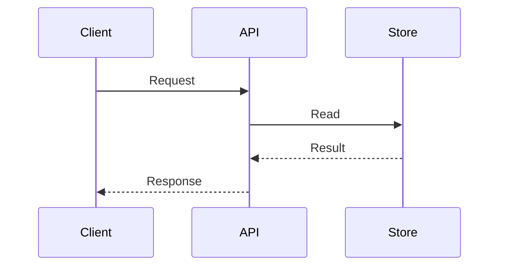
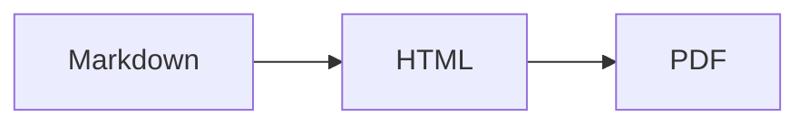

# pulsedeck

Write slides in Markdown or bring a self-contained HTML document, run a local server, and present either in the browser.

> `pulsedeck` is a fork of [`deckrun`](https://github.com/arpitbbhayani/deckrun) by Arpit Bhayani. The core engine — parsing, theming, presenting, PDF export, and the local-only server — is untouched; this fork adds an `ibm carbon` theme, a `devpulse`-to-deck exporter, a deck-linting CI workflow, and a Claude Code skill for turning documents into decks. See [`CLAUDE.md`](CLAUDE.md) for what's added and why.

- **Two formats** - Markdown decks with slide-by-slide presentation, or self-contained HTML documents with continuous scrolling
- **Live editor** - edit alongside a live preview, with autosave and a library of all your decks and docs
- **15 themes** - unique palettes, typography, animated backdrops, four type sizes, and customizable heading and body fonts
- **Templates and motion** - four composition templates and five transitions, switchable without touching the Markdown
- **Technical content** - KaTeX equations and Mermaid diagrams in preview, presentation, HTML, and PDF
- **Incremental reveals** - step through bullets, prose, equations, code, or diagrams without duplicating slides
- **Deck linting** - catch empty slides, broken fences/math, dense content, image issues, and invalid reveal markers locally or in CI
- **Presenter tools** - laser pointer, drawing pen, blank canvas, blackout mode, and `?` for shortcuts
- **Notes while presenting** - present from the editor and its preview and notes panel follow the deck tab, so the editor is your notes screen
- **Export** - Markdown, HTML, headless-rendered PDF, or a standalone presenter-ready HTML page
- **Local-first** - binds only to `127.0.0.1`; nothing is uploaded, and your work stays in browser local storage until export


## Quick start

Check out the sample Markdown source in [`examples/example-2.md`](https://raw.githubusercontent.com/arpitbbhayani/deckrun/refs/heads/master/examples/example-2.md) and load it directly to see how `pulsedeck` presents it (no installation required):

```bash
npx pulsedeck
```

## Installation

Install globally from npm:

```bash
npm install -g pulsedeck
```

Or run it without installing:

```bash
npx pulsedeck              # open the editor
npx pulsedeck slides.md    # present a local file
npx pulsedeck <url>        # present a public Markdown or HTML URL
```

## Usage

```bash
# Write a new deck in the built-in editor
pulsedeck

# Serve on the default port 7890 and open the browser
pulsedeck slides.md

# Present a self-contained HTML page instead of a Markdown deck
pulsedeck page.html

# Serve on a custom port
pulsedeck slides.md -p 3000

# Start the server without opening a browser tab
pulsedeck slides.md --no-open

# Show a launch overlay that enters fullscreen on the first key or click
pulsedeck slides.md --fullscreen

# Pick one of the fifteen themes, at one of four type sizes
pulsedeck slides.md --theme paper
pulsedeck slides.md --theme paper --size xl

# Or set the two faces yourself
pulsedeck slides.md --theme tokyo --head-font playfair --body-font lora

# Recompose the same Markdown and choose how slides move
pulsedeck slides.md --template editorial --transition fade

# Check one or more decks before presenting or committing them
pulsedeck lint slides.md
pulsedeck lint talks/*.md --format json

pulsedeck --list-themes
pulsedeck --list-sizes
pulsedeck --list-fonts
pulsedeck --list-templates
pulsedeck --list-transitions
```

On start, the CLI prints the slide count and the local URL:

```text
8 slides from slides.md
present → http://127.0.0.1:7890  (Ctrl+C to stop)
```

With no file or URL, it starts the editor instead:

```text
editor → http://127.0.0.1:7890  (Ctrl+C to stop)
write on the left, live deck on the right. autosaves to your browser.
Cmd/Ctrl+K inserts anything · Cmd/Ctrl+Shift+L switches theme · Cmd/Ctrl+Enter presents
```

The server binds to `127.0.0.1` only, so the deck is never exposed on the network. Stop it with `Ctrl+C`.

### CLI options

| Option                | Default | Description                                            |
| --------------------- | ------- | ------------------------------------------------------ |
| `[file]`              |         | Markdown file, HTML file, or public URL to present. Omit it to open the editor. |
| `-p, --port <number>` | `7890`  | Port to serve the presentation on                      |
| `--no-open`           | `false` | Start the HTTP server without opening the browser      |
| `--fullscreen`        | `false` | Prompt to enter fullscreen on the first key or click   |
| `--theme <name>`      | `nord`     | Any of the fifteen themes, by id                   |
| `--size <name>`       | `m`     | Type size: `s`, `m`, `l`, or `xl`                       |
| `--head-font <name>`  |         | Override the theme's heading and title face             |
| `--body-font <name>`  |         | Override the theme's body face                          |
| `--template <name>`   | `classic` | Composition: `classic`, `minimal`, `editorial`, or `spotlight` |
| `--transition <name>` | `slide` | Motion: `slide`, `fade`, `zoom`, `lift`, or `none`       |
| `--list-themes`       |         | Print every theme with its mood and blurb, then exit    |
| `--list-sizes`        |         | Print every type size with what it is for, then exit    |
| `--list-fonts`        |         | Print every face and its kind, then exit                |
| `--list-templates`    |         | Print every composition template, then exit             |
| `--list-transitions`  |         | Print every slide transition, then exit                 |
| `-v, --version`       |         | Print the version number                               |
| `-h, --help`          |         | Print help for the command                             |

An unknown `--theme`, `--size`, or font is an error rather than a silent fallback, so a typo does not quietly hand you the default. `dark` and `light` still name the two original palettes. In the editor, `--theme` and `--size` set the starting look and `Cmd Shift L` opens the picker to change either one live.

`--size`, `--head-font`, and `--body-font` apply to Markdown decks only. An HTML doc brings its own typography; passing any of them alongside an `.html`/`.htm` file prints a notice and is otherwise ignored.

### `pulsedeck lint`

The lint command performs fast, browser-free checks and reports the source
line, slide number, severity, and rule id for each problem:

```bash
pulsedeck lint slides.md
pulsedeck lint intro.md architecture.md
pulsedeck lint slides.md --format json
pulsedeck lint slides.md --max-warnings -1
```

It catches empty decks/slides, unclosed code fences and display math, untagged
code fences, excessive prose or bullets, overly long headings, missing image
alt text, invalid image opacity, and malformed or excessive reveal markers.
Errors fail the command. Warnings also fail by default, making the command
useful in CI; `--max-warnings N` changes that threshold and `-1` allows any
number of warnings. Pass `-` as the file to lint standard input.

## The editor

Run `pulsedeck` with no file and it serves an editor instead of a deck. A deck already in this browser resumes with no extra step, exactly as before. The first time you run it — or any time you choose "new" from the library with nothing open yet — you land on a start screen instead: a new Markdown deck, a new or uploaded HTML doc, or the library. Pick Markdown and you get the usual pane pair, Markdown on the left and the live deck on the right, plus a library of every deck and doc you have written.

```bash
pulsedeck
pulsedeck --theme paper --size l   # start the editor in a given look
pulsedeck --head-font syne         # and a face of your own
pulsedeck -p 3000            # editor on another port
```

The preview is not an approximation. Every keystroke is parsed by the same parser the CLI uses, and the slides render inside an iframe fixed at 1600x900 with the deck's own stylesheet. Pressing present POSTs the Markdown back to the server, which builds the deck exactly as `pulsedeck file.md` would. The output is byte-identical.

### The two bars

The top bar is for decisions: the deck name, the library, and then everything
that changes what the deck looks like — `template`, `theme`, `font`, and the `S M L XL`
type size — with `guide`, `insert`, `new`, `export`, and `present` beside
them.

The bottom bar is for counts and status: caret position, word count, slide
count, a tip line, and any message the editor has for you. Nothing that only
tells you where you are belongs in a bar you reach for to act.

The top bar wraps rather than scrolls when a window is narrow, since a
scrollable bar would clip the menus that hang out of it. Before it wraps it
sheds the keyboard hints, then `new` and `guide`, both of which the command
palette also carries.

`new` reopens the same start screen shown on a first run — pick Markdown or
HTML from there to bring another deck or doc into the library without losing
the one you have open.

### Writing

- The caret drives the preview. Move it into a slide and the preview follows.
- The gutter labels each `---` with the slide it starts, so you can see the deck's shape while you type.
- Markdown is syntax-highlighted in place: headings by level, bold, italic, inline code, links, image directives, fences, tables, notes, and raw HTML each get their own color.
- Enter continues the list you are in, and continues numbering. Enter on an empty item ends the list.
- Tab inserts two spaces.
- `Alt Left` / `Alt Right` (or `Alt Up` / `Alt Down`) hop the caret between slides.

### Discovering what a slide can hold

Three surfaces exist so you never have to remember the syntax:

- Guide drawer (`Cmd /`): every slide layout, text style, list, table, code block, image directive, and embed, grouped and explained, each with an insert button that drops it at your caret.
- Command palette (`Cmd K`): the same catalogue, searchable, plus the actions. Type "split", "embed", or "notes" and hit enter.
- Contextual nudges: a prompt appears in the editor when the document suggests one. A slide that overflows its own canvas, a code fence with no language tag, an image that could be a split layout, a deck with no speaker notes, a slide carrying too many bullets. Each nudge inserts the fix or dismisses for good.

A tip line in the status bar cycles through the rest.

The Markdown start screen also carries template and transition choices. Pick
them before creating or importing a deck, or use the `template` menu later.
Templates are CSS compositions rather than source transformations, so changing
one after the deck is finished immediately recomposes every slide while the
Markdown remains byte-for-byte unchanged.

### Images

Images are referenced by path, exactly as in a file-based deck. The editor serves the directory you launched in, so launch `pulsedeck` next to your diagrams and `` resolves.

The guide and the palette carry every directive, so the layouts are one keystroke away rather than something to remember. Images are not uploaded or embedded: the editor keeps Markdown, and the files stay on disk where you put them.

### HTML documents

Alongside Markdown decks, pulsedeck can present a second kind of document: a self-contained HTML page with no slide boundaries — a single continuous doc, not a series of slides. There is no blank-slate option: get one into the editor from the start screen by uploading a `.html` file or pointing it at a public HTML URL (fetched server-side, so the page's own CORS policy does not matter), by dropping a `.html` file onto the editor, or on the CLI with `pulsedeck page.html`.

Editing is a plain source pane on the left and a live preview on the right — no syntax highlighting, gutter, guide drawer, or command palette, since there are no slide-authoring directives to catalogue. The preview updates from the textarea directly, with no server round trip.

Presenting wraps the doc in an iframe and layers the tool belt that still makes sense with no slides — laser pointer, pen, blank canvas, blackout, fullscreen, and `?` for controls — on top of it. There is no HUD, slide counter, overview grid, or arrow-key navigation, since there is nothing to count or step through.

A doc authored in the browser editor is expected to be self-contained: inline styles and scripts, and assets from a CDN or a `data:` URI rather than a relative local path, since editor-mode present and PDF serve it from an in-memory copy, not from a folder on disk. A file passed on the CLI does not have that restriction — `pulsedeck page.html` serves it from the file's own directory, exactly like a Markdown deck's images, so `` next to `page.html` resolves normally.

If a doc runs its own script that listens for keyboard input — an embedded framework, a game, a chart with its own shortcuts — it may end up racing pulsedeck's own listener for a key, since both are attached to the same page. Presenter shortcuts are best-effort in that case, not guaranteed to win.

### The deck library

Every deck or doc you write is kept in this browser, not just the last one. The `decks` button in the top bar shows how many there are, and `Cmd O` opens the library. Markdown decks and HTML docs share one list.

- Each row shows the name, its kind, a size — slide count for a deck, character count for a doc — and when you last touched it. Click one, or use the arrows and enter, to open it.
- Decks are listed most recently edited first, so the one you want is usually at the top.
- The open deck is saved before another one loads, so switching never costs you an edit.
- Duplicate copies an entry into the library and opens the copy. Delete asks first and is permanent.
- `new`, in the top bar or from the library, opens the start screen rather than immediately clearing the pane — pick Markdown or HTML there, blank or uploaded, or an HTML doc by URL.
- Uploading a file from the start screen, or dropping a `.md`/`.html` file onto the editor, lands it as a new entry of the matching kind. Name collisions get a numeric suffix rather than overwriting.
- Rename with the name field in the top bar. That name is also the export filename.

Storage layout: an index under `deckrun.decks.v1` holds metadata only, and each entry's content lives under `deckrun.deck.<id>`. Listing your library never reads that text.

### Saving

The open deck autosaves to `localStorage` half a second after you stop typing, the way a local-first drawing tool does. A successful save says nothing — it is automatic and it is reliable, and a clock ticking in the corner is not information. Only a failure speaks up, in the status bar and in a toast.

- Nothing is uploaded. The server is on `127.0.0.1` and only ever sees Markdown you are actively previewing.
- Storage is scoped to the origin, which includes the port. Decks written on `:7890` are not visible on `:3000`, so stay on the default port or pass the same `-p` each time.
- Browsers cap `localStorage` near 5 MB across all your decks. Past that the save fails loudly and tells you to download or delete, rather than quietly losing work.
- A browser that blocks storage outright, like a private window, is detected at startup and says so instead of pretending to save.
- Export writes a copy out of the browser. Source, PDF, and a presenter-ready page are all in the `export` menu.

### Exporting

The `export` button in the top bar opens a menu with three formats. All three are named from the name field, and the menu relabels itself for an HTML doc.

| Format               | Shortcut      | Result                                                              |
| --------------------- | ------------- | ------------------------------------------------------------------- |
| Markdown / Source     | `Cmd S`       | The plain text you see in the editor — `.md` for a deck, `.html` for a doc |
| PDF                   | `Cmd Shift S` | A real `.pdf` file — one 16:9 page per slide for a deck, or the doc's own pages for an HTML doc |
| HTML / Presenter Page |               | One standalone `.html` page: the deck, or the doc wrapped with the presenter tool belt |

PDF export does not hand you a print dialog. The server drives a headless browser over the built deck and streams back the finished file, so there is nothing to configure and nothing to get wrong. Pages are 13.333in by 7.5in, the standard widescreen slide size, with no margins: the theme, its backdrop geometry, code block surfaces, table fills, and background images all come through, and the HUD, arrows, cursor, pets, and speaker notes are stripped.

It uses a Chromium-family browser already on your machine and installs nothing. Chrome, Chromium, Edge, and Brave are found automatically in their usual locations; `DECKRUN_BROWSER`, `CHROME_PATH`, or `PUPPETEER_EXECUTABLE_PATH` points at one somewhere else, checked in that order. A render takes a few seconds, and only one runs at a time.

With no such browser on the machine, the editor falls back to opening the deck with the print dialog up and says so. That route now produces the same pages, because the print stylesheet sets the page box itself.

The HTML export is the same page `pulsedeck` serves: styles and the navigation runtime are inlined, so it opens from disk, and keyboard, touch, overview, and fullscreen all still work. Two things do not travel with it, since it is one file rather than a bundle:

- Fonts, syntax highlighting, KaTeX, and Mermaid load from pinned CDNs in a standalone export, so a viewer needs a connection to see them exactly as you do. The theme, template, transitions, colors, and backdrop are inline.
- Images and videos referenced by path stay on your disk. Ship them alongside, or host the page where those paths resolve.

An HTML doc's PDF is not paginated to 16:9 slides — it prints the doc's own `@page`/print CSS (or Chrome's defaults if it has none), exactly as if you had opened the file yourself and pressed print. There is no presenter chrome to strip, since the doc is printed on its own, without the tool-belt wrapper.

### Preview controls

- Single mode scales one slide to fit the pane, with speaker notes underneath when the slide has them.
- Grid mode (`Cmd G`) lays out the whole deck. Click any slide to jump the caret to it.
- Drag the divider to resize the panes. Double-click it to snap back to an even split. The position is remembered.

### Editor shortcuts

| Keys                | Action                    |
| ------------------- | ------------------------- |
| `Cmd K`             | Command palette            |
| `Cmd O`             | Deck library               |
| `Cmd /`             | Guide drawer               |
| `Cmd Enter`         | Present in a new tab       |
| `Cmd S`             | Export Markdown            |
| `Cmd Shift S`       | Export PDF                 |
| `Cmd D`             | New slide                  |
| `Cmd B`             | Bold                       |
| `Cmd I`             | Italic                     |
| `Cmd E`             | Inline code                |
| `Cmd G`             | Toggle grid preview        |
| `Cmd Shift L`       | Theme and type size picker  |
| `Alt Left`, `Alt Right`, `Alt Up`, `Alt Down`| Previous and next slide |
| `Esc`               | Close a menu, the palette, or the guide |

`Cmd K` (palette), `Cmd /` (guide), `Cmd D/B/I/E` (snippets), and `Cmd G` (grid) are Markdown-only — an HTML doc's source is plain text with no snippet catalog or grid view. Library, present, and both exports stay wired the same for either kind.

On Windows and Linux, `Ctrl` replaces `Cmd`.

### Editor routes

The editor adds a few endpoints under `/__`, all local:

| Route             | Purpose                                                            |
| ------------------ | ------------------------------------------------------------------ |
| `/__preview`       | The iframe that renders slides with the deck stylesheet              |
| `/__parse`         | POST Markdown, get back rendered slides and notes                    |
| `/__present`       | POST Markdown, get back the path to a freshly built deck              |
| `/__pdf`           | POST Markdown, get back a rendered PDF                                |
| `/__present-doc`   | POST an HTML doc, get back the path to its presenter-wrapped page     |
| `/__pdf-doc`       | POST an HTML doc, get back a rendered PDF of the doc itself            |
| `/__fetch-doc`     | POST a public URL, get back that page's HTML, fetched server-side     |
| `/?deck=<n>`       | A built deck or stashed doc, kept in memory. The last eight are retained |

A built deck is served from `/` rather than a subpath on purpose. Served from `/__deck/1`, a slide's `` would resolve against `/__deck/` and 404.

Everything else on the URL is served from the directory you launched in, so `` and `<video src="clip.mp4">` work against local files without inlining them.

## Slide authoring

### Slide separators

Separate slides with `---` on a line of its own. Leading and trailing spaces or tabs on that line are allowed:

```markdown
# First slide

Introduction text goes here.

---

## Second slide

Content for the next slide.

---

# Conclusion
```

Empty slides are dropped, so trailing separators are harmless. A `---` on the very first line is not a separator, which means YAML frontmatter is not supported.

Two more things `---` does that catch people out:

- It breaks a slide even inside a fenced code block. A `---` line in your code sample will split the deck there, so use a different separator in sample output.
- It is the only slide break. For a horizontal rule inside a slide, write `***` or `___`.

### Page title

The rendered page title comes from the first heading of the first slide, with any inline markup stripped. If the first slide has no heading, the Markdown filename is used instead.

### Markdown support

Slides are rendered with [marked](https://github.com/markedjs/marked), so standard Markdown works: headings, paragraphs, ordered and unordered lists with nesting, tables, blockquotes, horizontal rules, links, inline code, bold, and italic.

Each element is styled for projection rather than reading:

| Element         | Treatment                                                          |
| --------------- | ------------------------------------------------------------------ |
| `h1`            | Largest, mauve, intended for section and title slides              |
| `h2`            | Blue, the default slide title                                      |
| `h3`            | Sky blue subheading                                                |
| `h4`            | Teal, smallest heading                                             |
| Bold            | Peach, for the single term that must land                          |
| Italic          | Muted subtext, for asides                                          |
| Inline code     | Green on a bordered surface chip                                   |
| List markers    | Mauve bullets and numbers                                          |
| Tables          | Lavender headers, mauve underline, zebra-striped rows              |
| Blockquotes     | Mauve left rule on a tinted background                             |
| Links           | Blue with an offset underline                                      |

Font sizes use `clamp()` against the viewport, so the same deck reads correctly on a laptop and on a projector without changes. Content that overflows a slide is clipped rather than scrolled, which is a deliberate nudge to split the slide.

An example that exercises most of the above:

```markdown
## System Architecture

> Any fool can write code that a computer can understand. Good programmers write code that humans can understand. - Martin Fowler

- Ingestion pipeline with backpressure controls
- Memory-mapped buffer storage
  - Zero-copy ring buffer
  - Page-aligned disk persistence

| Service     | Port | Protocol |
| ----------- | ---- | -------- |
| api-gateway | 8080 | HTTP/2   |
| worker-pool | 9090 | gRPC     |
```

### Code blocks

Fenced code blocks are highlighted by Highlight.js in the browser. Tag the language so the grammar is picked correctly:

````markdown
```typescript
interface Slide {
  html: string;
  bgImage?: PositionedImage;
  rightImage?: PositionedImage;
  leftImage?: PositionedImage;
  notes?: string;
}

function parseSlides(markdown: string): Slide[] {
  return markdown
    .split(/\n---\n/)
    .filter(Boolean)
    .map(raw => processSlide(raw));
}
```
````

Code blocks scroll horizontally when a line is too long, so long lines never reflow mid-presentation.

### Math and Mermaid diagrams

KaTeX renders inline math with single dollar delimiters and display math with
double dollars. The bracket forms `\(...\)` and `\[...\]` work too:

```markdown
The amortized cost is $O(1)$ per operation.

$$
T(n) = T(n/2) + O(n) = O(n)
$$
```

Mermaid diagrams use an ordinary language-tagged fence:

````markdown

````

Both render in the live preview, a presented deck, standalone HTML, and PDF.
The editor waits for the equation or diagram before measuring slide overflow,
and PDF rendering uses the copies installed with pulsedeck rather than waiting on
a CDN. Invalid source stays visible as an error on the slide instead of
silently disappearing.

### Incremental reveals

Append `{reveal}` to a bullet or another Markdown block. Forward navigation
reveals each marked block before advancing to the next slide; backward
navigation hides revealed blocks before returning to the previous slide:

```markdown
## Three stages

- Parse the Markdown
- Build semantic HTML {reveal}
- Render the final slide {reveal}
```

Put the marker on its own line to reveal the entire block after it. This works
for paragraphs, blockquotes, equations, code fences, and Mermaid diagrams:

````markdown
{reveal}

````

The editor preview and grid show the complete slide so you can author and
detect overflow against the final state. Overview thumbnails and PDF also show
all content; reveals are interactive only while presenting. Reduced-motion
preferences keep the reveal but remove its movement.

### Embeds and inline HTML

Raw HTML passes through untouched, so anything the browser can render can live on a slide.

```markdown
<iframe src="https://www.youtube.com/embed/VIDEO_ID" allowfullscreen></iframe>

<video src="demo.mp4" controls muted loop></video>

Press <kbd>Cmd</kbd> <kbd>K</kbd> to open the palette, and latency drops to <mark>4.1ms</mark>.
```

| Element    | Treatment                                                                    |
| ---------- | ---------------------------------------------------------------------------- |
| `iframe`   | Forced to full width at a 16:9 ratio, bordered and rounded                    |
| `video`    | Centered, capped at 60% of the slide height, aspect ratio preserved            |
| `kbd`      | Rendered as a physical key cap in lavender                                     |
| `mark`     | Yellow underline on a tinted background                                        |

Local videos are served from the folder you launched in, so `demo.mp4` next to your Markdown just works. Embeds need network access at presentation time, and they do not survive a PDF export.

### Speaker notes

Attach notes to a slide with an HTML comment carrying a `note:` or `notes:` directive:

```markdown
## Deployment Strategy

Rolling deployment with zero downtime.

<!-- notes: Review database migration rollout steps before advancing. -->
```

Every such comment is stripped from the slide, so notes never leak into the projected output or the PDF export. When you present from the editor, the notes of the slide on screen are shown in the editor's notes panel instead.

### Image layout directives

Image placement is controlled by the Markdown title attribute, the quoted string after the URL:

```markdown


```

| Directive   | Description                                                                    |
| ----------- | ------------------------------------------------------------------------------ |
| `right`     | Split layout: content on the left, image fills the right panel                  |
| `left`      | Split layout: image fills the left panel, content on the right                  |
| `bg`        | Background layout: image covers the slide canvas beneath the text               |
| `opacity:N` | Opacity between `0.0` and `1.0`, combinable with `left`, `right`, or `bg`       |

Notes on how directives are parsed:

- Matching is case-insensitive and substring-based, so reserve the title attribute for directives. A title like `"Left panel of the gateway"` is read as a `left` directive.
- Precedence is `right`, then `left`, then `bg`, when more than one appears.
- `opacity` accepts `opacity:0.8`, `opacity=0.8`, or `opacity 0.8`, and clamps to the `0.0` to `1.0` range.
- One positioned image of each kind applies per slide. If two `right` images appear, the last one wins.
- A positioned image is lifted out of the text flow, so its position in the Markdown source does not matter.

Images with no directive stay inline, centered in the document flow and capped at 55% of the viewport height. Panel images are capped at 78% and keep their aspect ratio with a drop shadow.

## Themes

Fifteen themes, nine dark and six light. A theme is not just a palette: each
one brings its own display, body, and monospace faces, its own Highlight.js
grammar colors, and its own animated geometry behind the slides.

| id           | mood  | what it is                                                          |
| ------------ | ----- | ------------------------------------------------------------------- |
| `midnight`   | dark  | Catppuccin Mocha. Violet on deep indigo, drifting orbs               |
| `tokyo`      | dark  | Tokyo Night. Neon cyan over a wireframe grid                         |
| `nord`       | dark  | Arctic frost blue on polar slate, with slow contour waves            |
| `dracula`    | dark  | Purple and hot pink over charcoal, lit by a gradient mesh            |
| `gruvbox`    | dark  | Warm amber and moss on retro brown, hatched like graph paper         |
| `rosepine`   | dark  | Rosé Pine. Muted iris and gold on plum, under a slow aurora          |
| `forest`     | dark  | Everforest sage on deep pine, rippling in concentric rings           |
| `neon`       | dark  | Electric cyan and magenta on true black, raked by light beams        |
| `carbon`     | dark  | IBM Carbon Design System. Blue 60 on Gray 100, gridded and precise    |
| `daylight`   | light | Catppuccin Latte, contrast-tuned for a projector. Dot matrix         |
| `arctic`     | light | Nord inverted. Frost blue on cool paper, with contour waves          |
| `solarized`  | light | The classic low-glare cream, paired with Lora for long prose         |
| `paper`      | light | Crimson serif on warm cream. Editorial, print-first, very legible    |
| `rosequartz` | light | Rosé Pine Dawn. Blush and iris on linen, with soft orbs              |
| `swiss`      | light | Black on white, one red. Heavy grotesk, tight tracking, hard grid    |

```bash
pulsedeck slides.md --theme paper
pulsedeck --list-themes
```

`dark` and `light` are kept as aliases for `midnight` and `daylight`, so older
commands and scripts keep working. So are `mocha`, `latte`, `tokyo-night`,
`rose-pine`, and `rose-quartz`.

In a file-backed deck the theme is baked into the page at launch, so switching
means restarting with a different flag. In the editor it is live: `Cmd Shift L`
opens a picker where the arrow keys preview each theme on the real deck as you
move, `Enter` keeps the one you land on, and `Esc` puts back the one you had.
The same picker carries the type size. Both choices are remembered per browser
and travel into the deck you present and the PDF you export.

### Backdrops

Every theme names one of ten backdrop patterns, drawn behind the slides in the
theme's own accent colors and drifting slowly enough to read as depth rather
than as motion: `orbs`, `grid`, `dots`, `topo`, `beams`, `rings`, `waves`,
`mesh`, `aurora`, and `none`.

The whole backdrop is CSS custom properties and gradients — no canvas, no
images, no JavaScript — so it survives into the PDF, where it is re-attached to
each page (a fixed element does not repeat across a paged medium). Anyone who
has `prefers-reduced-motion` set gets the geometry without the drift.

### Type size

Any theme can be set at four sizes, so the two choices compose instead of
multiplying into fifty-six presets:

| id   | name    | what it is for                                                  |
| ---- | ------- | --------------------------------------------------------------- |
| `s`  | small   | More on a slide. Dense reference decks, close screens.           |
| `m`  | medium  | The default. Reads from the middle of a normal room.             |
| `l`  | large   | A wide room, or a talk of a handful of lines a slide.            |
| `xl` | x-large | Readable from the back row. Expect three or four lines a slide.  |

```bash
pulsedeck slides.md --size xl
pulsedeck --list-sizes
```

The scale is not one multiplier over everything. Headings and prose pull in
different directions as a deck grows: at `xl` the point is to get the *reading*
text to the back row, and the headings are already legible, so prose grows
further than they do — 1.38× against 1.24×. At `s` the reverse. Leading tightens
as the type grows so lines stay in one block, and the slide gives back some of
its padding so the extra size has somewhere to go. `m` is exactly 1 across the
board, so it is the sizing the stylesheet states literally and the other three
are honest multiples of it.

Sizes are set in `SIZE_SPECS` in `src/themes.ts`, in the same shape as the
themes: a display, body, and code multiplier, a leading factor, and the slide
padding. List indents, bullet markers, and the blockquote glyph are all in `em`,
so they track whatever size is on rather than drifting into the text.

In the editor the size lives in the same picker as the theme (`Cmd Shift L`),
where `[` and `]` step it. Unlike the theme, which is previewed and can be
abandoned with `Esc`, a size click sticks right away. It is remembered per
browser, applies to every theme, and travels into the deck you present and the
PDF you export.

### Faces

Headings use the theme's display face, body copy its body face, and code, key
caps, and the presenter chrome its monospace face. Faces come from Google
Fonts in a single request; the browser only downloads the files a rendered
slide actually paints.

The heading and the body face can each be replaced without leaving the theme,
and they are chosen **separately** — a serif heading over a sans body, or the
reverse, is a setting rather than a fork:

```bash
pulsedeck slides.md --theme tokyo --head-font playfair --body-font lora
pulsedeck slides.md --body-font newsreader     # heading stays the theme's
pulsedeck --list-fonts
```

Twenty faces, grouped sans, serif, and mono: `inter`, `spaceGrotesk`, `sora`,
`manrope`, `figtree`, `outfit`, `archivo`, `syne`, `bricolage`, `workSans`,
`plexSans`, `fraunces`, `playfair`, `newsreader`, `lora`, `plexMono`,
`jetbrains`, `firaCode`, `spaceMono`, `sourceCodePro`. Their human names work
too, so `--head-font "Playfair Display"` is the same as `--head-font playfair`.

The monospace face is not overridable on purpose: code wants the face the
palette's syntax highlighting was chosen against.

Overrides are attributes, not a second palette. `[data-head]` and `[data-body]`
carry the same specificity as `[data-theme]` and are emitted after it, so
source order decides and the override wins. No attribute means the theme's own
face — which is why there is no "default" entry to keep in step with anything,
and why a face the deck does not recognise falls back silently rather than
leaving a slide unstyled.

In the editor the two live in one `font` menu in the top bar, side by side:
heading on the left, body on the right, every row set in the face it offers.
Picking does not close the menu, because choosing a heading and then a body is
one decision. Both are remembered per browser and travel into the deck you
present and the PDF you export.

### Templates and transitions

Templates compose with themes. A theme owns color and type; a template owns
spacing, alignment, rules, image treatment, and the overall reading rhythm:

| id          | composition                                                        |
| ----------- | ------------------------------------------------------------------ |
| `classic`   | The original balanced pulsedeck layout                              |
| `minimal`   | Quiet surfaces, wider margins, fewer decorative treatments        |
| `editorial` | Strong rules and magazine-like reading rhythm                     |
| `spotlight` | Centered, high-impact composition for concise keynote slides       |

Pick one on the editor start screen or switch it later from the `template`
menu. Switching only changes the root `data-template` attribute and CSS, so an
existing deck transforms instantly and its Markdown is untouched.

The same menu carries five independent transitions: `slide`, `fade`, `zoom`,
`lift`, and `none`. `prefers-reduced-motion` suppresses their spatial motion,
and print/PDF disables them entirely.

```bash
pulsedeck slides.md --template spotlight --transition zoom
pulsedeck --list-templates
pulsedeck --list-transitions
```

### Type and motion

Slides also assemble rather than appear: each top-level block on a slide rises
into place a beat after the one above it. That stagger is turned off in the
editor preview, where the slide is rebuilt on every keystroke, and in the PDF.
`prefers-reduced-motion` turns it off everywhere.

### Writing your own theme

Themes live in `src/themes.ts`. Append one entry to `SPECS` and it appears
everywhere at once: the `--theme` flag, `--list-themes`, the editor's picker,
the live preview, the HTML export, and the PDF. Nothing else needs touching.

An entry is four things:

- **`neutrals`** — an eleven-step ramp from the page's outermost background
  (`crust`) to its strongest foreground (`text`). Light themes run the same
  direction: `crust` is still the backdrop, `text` is still the ink.
- **`accents`** — eleven hues, named after the Catppuccin slots so existing
  palettes port across by copy and paste. They are the deck's paint box:
  `<mark>`, list markers, table headers, and the five pen colors all draw from
  here.
- **`roles`** — which three of those colors lead. `accent` carries h1, the
  caret, focus rings, and every piece of chrome; `accent2` carries h2 and
  links; `accent3` carries h3. Point them at any neutral or accent key — that
  is how `nord` leads with frost blue while `gruvbox` leads with amber.
- **`type`** — a display face, a body face, a mono face, and the weight,
  tracking, and casing the display face wants. Faces come from the `FONTS`
  catalog at the top of the file; add an entry there to use a new one.

Plus `decor` for the backdrop and `hljs` for the code stylesheet.

```ts
seafoam: {
  label: "seafoam",
  mood: "dark",
  blurb: "Pale green on graphite, with a dot matrix.",
  neutrals: { crust: "#0f1413", mantle: "#141a19", /* … eleven in all */ },
  accents:  { teal: "#7fd6c1", blue: "#78b7d0", /* … eleven in all */ },
  roles: { accent: "teal", accent2: "blue", accent3: "green" },
  type: { display: "sora", body: "inter", mono: "jetbrains", weight: 700 },
  decor: "dots",
  hljs: `${HL}atom-one-dark.min.css`,
},
```

Everything else is derived from those four inputs — the accent tints, the
overlay scrims, the shadows (black on dark themes, tinted with the ink color on
light ones), the hairlines, the h1 rule gradient, and the backdrop's own
colors. That is deliberate: a new theme cannot fall out of step with itself,
and there is nothing to hand-tune per surface.

The palette is emitted as CSS custom properties, once per theme under a
`[data-theme]` selector in the editor and preview and once on `:root` in a
built deck, so overriding a single value in a fork stays a one-line change.

## Navigation and controls

### Keyboard shortcuts

| Key                                  | Action                                   |
| ------------------------------------ | ---------------------------------------- |
| `Right`, `Down`, `Space`, `PageDown` | Advance to the next reveal or slide       |
| `Left`, `Up`, `Backspace`, `PageUp`  | Return to the previous reveal or slide    |
| `Home`                               | Jump to the first slide                   |
| `End`                                | Jump to the last slide                    |
| `O`                                  | Toggle the overview grid                  |
| `F`                                  | Toggle fullscreen                         |
| `L`                                  | Toggle the laser pointer                  |
| `D`                                  | Toggle the pen and draw on the slide      |
| `C`                                  | Toggle a blank canvas over the slide      |
| `B`                                  | Black out the screen                      |
| `?`, `H`                             | Show every control                        |
| `Escape`                             | Close whatever is open, one layer at a time |

While the pen is down, these keys are live as well:

| Key                        | Action                                |
| -------------------------- | ------------------------------------- |
| `1` … `5`                  | Pick the pen color                    |
| `E`                        | Toggle the eraser                     |
| `[`, `]`                   | Thinner, thicker                      |
| `Ctrl+Z`, `Cmd+Z`          | Undo the last stroke                  |
| `X`                        | Clear this slide's annotations         |

They only bind while the pen is down, so the letters stay free for everything else the rest of the time.

### Mouse and touch

- Click the arrow buttons on either side of the screen. They dim at the first and last slide.
- Swipe horizontally on a touchscreen. A swipe longer than 50 pixels advances or goes back.
- Click any thumbnail in the overview to jump to that slide.

### Overview mode

Press `O` or `Escape` for a grid of live thumbnails of every slide. Each thumbnail is a scaled clone of the real slide, so code highlighting, tables, and images all appear as they will on screen. The current slide is outlined in blue. Click a thumbnail to jump there with the correct transition direction, or press `O` or `Escape` to return without moving.

Arrow keys do not move the selection inside the overview. Navigation happens by clicking.

### The footer controls

The bar along the bottom of a presented deck carries a button for each presenter tool, so a talk driven by a clicker or a trackpad needs no keyboard at all. `? controls` opens the same overlay `?` does: every key the deck listens for, grouped by what it does. An active tool lights up, and the pen strip with its color swatches, thickness, eraser, and clear button appears only while the pen is down.

### Laser pointer

Press `L` and the mouse cursor becomes a soft red dot with a glow around it, sized to be visible from the back of a room. The real cursor is hidden while it is on, so nothing competes with the dot. It works over anything: slides, the blank canvas, annotations already drawn. Press `L` again, or `Escape`, to put it away.

### Drawing on slides

Press `D` for a pen and draw straight onto the slide with the mouse, a trackpad, a pen tablet, or a finger.

- Annotations are held per slide, so you can mark up slide 3, keep going, and come back to find it as you left it.
- Arrow keys still navigate while the pen is down. Annotations that are merely on display do not swallow clicks, which keeps the nav arrows and footer buttons working.
- Strokes are stored in fractions of the viewport, not pixels, so resizing the window or entering fullscreen keeps them where you drew them.
- `Ctrl+Z` (`Cmd+Z`) removes the last stroke, `X` clears the slide, and `E` gives you an eraser that rubs out what it passes over rather than clearing everything.
- Nothing is written to disk. Reloading the deck starts clean, and the PDF export never contains annotations.

### Blank canvas

Press `C` and the same canvas paints itself opaque over the slide: a blank board for the diagram you did not plan for, in the deck's own background color. The pen arms itself when it opens. `C` again, or `Escape`, brings the slide back with whatever you drew still on it, since both modes share one board per slide. Navigation still works behind it, so every slide has its own blank board.

### Blacking out the screen

Press `B` to drop the screen to black, for the moment when the room should be looking at you rather than the slide. While it is up, keys cannot move the deck by accident: only `B`, `Escape`, `Space`, `Enter`, or a click brings it back.

### Fullscreen

Press `F` at any time to toggle fullscreen. Browsers only grant fullscreen from a user gesture, which is what `--fullscreen` works around: it shows a launch overlay that requests fullscreen on the first key or click, so the deck opens fullscreen without a manual step.

### Notes while presenting

Present **from the editor** (`Cmd+Enter`) and the deck opens in its own tab; the editor tab stays yours. Its preview and speaker-notes panel follow the deck's current slide, so the deck goes on the projector and the notes stay on your screen.

- A `following deck · n` chip appears in the status bar, showing the slide the deck is on. It follows however you advance the deck — keys, footer arrows, overview.
- Typing in the editor (or clicking the chip) stops the following and hands the screen back to the caret. Presenting again turns it back on.
- The link is live: it survives a reload of either tab.
- The notes shown are the slide's `<!-- notes: ... -->`, the same text the audience never sees.

A deck run straight from a file has no editor to follow it; present it through the editor instead (`pulsedeck`, then drag the file onto it, then `Cmd+Enter`) to get the notes during the talk.

## Visual design

- Terminal aesthetics throughout, set in IBM Plex Mono with a blinking mauve cursor in the top right corner.
- Direction-aware transitions. Slides slide in from the right going forward and from the left going back, over 380ms.
- A HUD at the bottom with a gradient progress bar and a current-slide counter.
- Three pixel pets, picked at random from [vscode-pets](https://github.com/tonybaloney/vscode-pets) and scattered along the bottom edge, at least 100 pixels apart.
- A keyboard hint that appears on load and fades after four seconds.
- A footer tool strip for the laser pointer, pen, blank canvas, blackout, and the controls overlay.

## PDF export

From the editor, press `Cmd Shift S` or pick PDF from the `export` menu, and a finished `.pdf` downloads. From a presented deck, print it with `Ctrl+P` or `Cmd+P`. Both produce the same pages.

- `@page` sets the page box to 13.333in by 7.5in with no margins, so every slide is one full-bleed 16:9 page. There is no orientation to choose.
- `print-color-adjust: exact` keeps the theme, its backdrop, the code block surfaces, the table fills, and background images, whether or not "Background graphics" is ticked in the dialog.
- Slides are sized in absolute units for print. Viewport units resolve against the page box in paged media, which is why a deck laid out in `vw` and `vh` came out as clipped portrait pages.
- The HUD, arrows, overview, cursor, pets, keyboard hint, fullscreen prompt, annotation canvas, laser pointer, blackout, and controls overlay are all hidden.
- Speaker notes are stripped at parse time, so they never reach the PDF.
- Incremental fragments are fully revealed, so printed and exported slides never omit content.

Loading any deck with `?print=1` on the URL opens the print dialog once fonts and highlighting have settled. That is the editor's fallback when there is no browser to drive, and it works on a file-backed deck too:

```bash
pulsedeck slides.md --no-open
# then open http://127.0.0.1:7890/?print=1
```

## Local asset server

`pulsedeck` serves the generated HTML at `/` and everything else relative to the directory holding the Markdown file. In editor mode there is no Markdown file, so it serves the directory you launched in. Local images, diagrams, videos, and fonts load over `http://` instead of `file://`, which avoids CORS restrictions on local assets.

- Served types include HTML, CSS, JS, JSON, PNG, JPEG, GIF, SVG, WebP, AVIF, ICO, MP4, WebM, WOFF, WOFF2, and TTF. Anything else is sent as `application/octet-stream`.
- Requests that resolve outside the Markdown file's directory return `403`. Missing files return `404`.
- If the requested port is taken, the server falls back to a random free port and prints the URL it settled on.

KaTeX and Mermaid are served from the copies installed with pulsedeck, which
keeps live preview and PDF rendering independent of the network. Google Fonts,
Highlight.js, and the pet sprites still load from CDNs, so a first run needs
network access for those visual extras.

## Generating decks and docs with Claude Code

### Markdown decks

Any tool that writes Markdown can write a `pulsedeck` deck. If you use Claude Code, the `blog-to-slides` skill turns a blog post, article, or long-form note into a deck in exactly this format: `---` separators, `## Title` per slide, language-tagged code blocks, and ASCII diagrams where a picture beats a paragraph.

```text
turn https://arpitbhayani.me/blogs/wal into slides
```

Then present the file it writes:

```bash
pulsedeck wal-slides.md
```

Or open the editor and drop the file onto it, which is the faster loop when you still want to cut a few slides:

```bash
pulsedeck
```

The skill is a personal Claude Code skill and is not bundled with this package. Add it under `~/.claude/skills/blog-to-slides/SKILL.md` to make it available across projects.

Formulas emitted as dollar-delimited LaTeX render with KaTeX. Mermaid fences
from generated Markdown render as diagrams as well.

### HTML documents

For a self-contained HTML doc instead of a Markdown deck, use the [`ape-present`](https://github.com/arpitbbhayani/ape-skills) skill. It turns a blog post into a single presentation-worthy HTML page — a readable long-form document with animated diagrams and just enough text to carry the idea — which is exactly the kind of doc `pulsedeck`'s presenter mode is built for.

```text
ape present https://arpitbhayani.me/blogs/wal
```

Then present the page it writes:

```bash
pulsedeck wal.html
```

Like `blog-to-slides`, this is a personal Claude Code skill from the same [ape-skills](https://github.com/arpitbbhayani/ape-skills) collection and is not bundled with this package.

## Complete deck template

A deck exercising split layouts, background images, opacity, syntax highlighting, tables, and speaker notes:

````markdown
# Scaling Distributed Systems

Building resilient, event-driven architectures in production.


<!-- notes: Introduce the talk and set context on modern distributed scale. -->

---

## Architectural Overview

- Microservices communicate over gRPC for low-latency RPCs
- Events stream through Apache Kafka for durable message logs
- Read replicas scale consumer queries horizontally


<!-- notes: Walk through the request path from gateway to storage engine. -->

---

## Consumer Worker Implementation

```go
func (w *Worker) ProcessEvent(ctx context.Context, msg *kafka.Message) error {
    ctx, cancel := context.WithTimeout(ctx, 5*time.Second)
    defer cancel()

    if err := w.store.Save(ctx, msg.Value); err != nil {
        return fmt.Errorf("failed to persist event: %w", err)
    }
    return nil
}
```

<!-- notes: Emphasize context timeout handling on message persistence. -->

---

## Performance Benchmark

| Configuration  | Throughput (req/s) | p99 Latency (ms) |
| -------------- | ------------------ | ---------------- |
| Single node    | 12,400             | 18.2             |
| 3-node cluster | 35,100             | 6.4              |
| 5-node cluster | 58,900             | 4.1              |

---

# Summary

- Favor asynchronous message passing for decoupled services
- Apply database timeouts at the connection and role layer
- Use structured event logs for auditing state mutations
````

## Examples

Two decks ship in `examples/`:

- `examples/example-1.md` is a feature walkthrough covering syntax, split layouts, opacity, and shortcuts
- `examples/example-2.md` is a full technical talk on databases and agentic AI

```bash
# Run the feature showcase deck
pulsedeck examples/example-1.md

# Or open the editor and drag either file onto it to edit
pulsedeck

# Run the technical talk in light theme on port 3000
pulsedeck examples/example-2.md -p 3000 --theme solarized --size l

# Run fullscreen without opening a browser
pulsedeck examples/example-1.md --fullscreen --no-open
```

## Not supported yet

Worth knowing before you plan a talk around them:

- No live reload in file mode. Editing the file needs a restart of the CLI. The editor previews as you type, so use it for the writing loop.
- Templates and transitions currently apply to the whole deck rather than one slide at a time.
- No `file://` mode. The deck always runs through the local HTTP server.
- The editor does not upload or embed images. It stores Markdown, and images load by path from the folder you launched in.
- The library lives in one browser and one origin. It does not sync between browsers or machines, so download anything you cannot afford to lose.

## Development

```bash
# Install dependencies
npm install

# Compile TypeScript to dist/
npm run build

# Run straight from source
npm run dev -- examples/example-1.md

# Run the editor from source
npm run dev
```

`dev` runs the TypeScript through [tsx](https://tsx.is). The `"module": "NodeNext"` setting means the source imports carry `.js` extensions, and neither `ts-node --esm` nor Node's own type stripping remaps those back to the `.ts` files on Node 20 and up — tsx does. Tested on Node 18, 20, 22, and 24.

The source:

- `src/index.ts` is the CLI, the HTTP server, the editor routes, and port selection
- `src/parser.ts` splits slides, extracts notes, and resolves image directives
- `src/themes.ts` is the theme registry and the type scale: palettes, font catalog, backdrop patterns, size presets, and the CSS they all emit
- `src/presentation-options.ts` is the composition-template and transition registry
- `src/fragments.ts` contains incremental-reveal styles and DOM preparation shared by preview and presentation
- `src/lint.ts` implements the static deck authoring rules behind `pulsedeck lint`
- `src/rich-content.ts` detects and renders KaTeX and Mermaid content, with a shared readiness signal
- `src/generate.ts` holds the slide CSS, the presenter chrome, and the deck runtime
- `src/preview.ts` is the editor's preview iframe, sharing the slide CSS with the deck
- `src/editor.ts` is the editor page: highlighting, palette, guide, nudges, autosave
- `src/editor-content.ts` is the snippet registry, tips, and welcome deck that the guide, the palette, and the nudges all read from

The deck and the editor preview share `RESET_CSS`, `SLIDE_CSS`, and `DECOR_CSS` out of `generate.ts`, and their palettes out of `themes.ts`, which is what keeps the preview honest. Change a slide style once and both move together.

Release steps live in [PUBLISHING.md](PUBLISHING.md).

## License

MIT. See [LICENSE](LICENSE).
