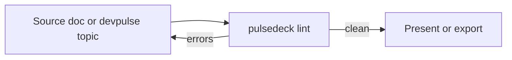

# AI Dev Enablement

### A template deck for internal training sessions

<!-- notes: Cold open. State the session's goal in one sentence before advancing — this deck is a format template, not real training content. -->

---

## Why decks-as-Markdown

- Reviewable and diffable like any other pull request
- One lint gate (`pulsedeck lint`) instead of "does the HTML look right"
- One visual identity (`--theme carbon`) instead of per-session styling
- Speaker notes travel with the deck instead of living in someone's head

<!-- notes: This slide replaces the old hand-built HTML deck pitch. Keep it short — the format speaks for itself once people see slide two. -->

---

## How a session's content flows in



The lint gate is the only quality bar. A deck that passes it is safe to
present or export to PDF without a manual pass.

---

## A tagged code fence

Always tag the language — an untagged fence is a lint warning, not just a
missed highlight:

```bash
node dist/index.js decks/sample-enablement-deck.md --theme carbon
```

<!-- notes: If someone asks why the deck looks different from last quarter's sessions, this is the flag that controls it. -->

---

## Reveal the steps one at a time

- Write the deck in Markdown {reveal}
- Run `pulsedeck lint` before presenting {reveal}
- Present with `--theme carbon` for a consistent look {reveal}

---

## Rollout status

| Track                        | Status      |
| ----------------------------- | ----------- |
| Markdown deck format           | Adopted     |
| `ibm carbon` theme             | Adopted     |
| CI lint gate                   | Adopted     |
| `devpulse` topic exporter      | In progress |

---

# Questions

Fork of [`deckrun`](https://github.com/arpitbbhayani/deckrun) by Arpit Bhayani.

<!-- notes: Close by pointing people at CLAUDE.md if they want to write their own deck or extend the theme. -->
